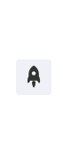

## Introduction



backToTop plugin for vuepress-theme-idear or other vuepress theme.

### Name

- **As plugin**: `@idear-vuepress/vuepress-plugin-backToTop`
- **As component**: `BackToTop` (auto appear in the page, no need for extra code)

## Option API

### icon

- description: name of icon in the middle of the button
- type: `String`
- default: `idear-up`
- accepted values: other built-in icons in the theme

### visibilityHeight

- description: minimum scrolling height before the button appears
- type: `Number`
- default: `400`

### customStyle

- description: button's cutomized style
- type: `Object`
- default:
  ```json
  {
    right:'1rem',
    bottom: '6rem',
    width: '2.5rem',
    height: '2.5rem',
    'border-radius': '.25rem',
    'line-height': '2.5rem',
    backgroundColor: 'rgba(231, 234, 241,.5)'
  }
  ```